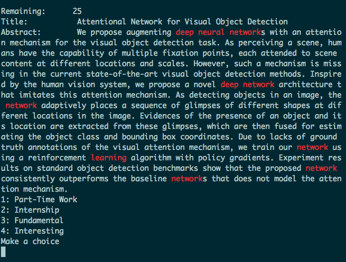

Arxiv Keeper
============
This tool is here to fasten the process of reviewing daily releases.


Setup
----------
If using for the first time; 

1. I use mysql, with a database called `arxiv_keeper`. Choose your favourite database engine(such as `mysql`, and it should be supported by `sqlalchemy`) and create a database with the name of your preference(`create database arxiv_keeper` in my case).
2. Open `settings.py` and edit the `CONNECTION_STRING`. 
3. Create the `entry` table by running `python model.py`.
4. Edit the `FOLDERS` based on your interests. (No more than 9)(Don't forget to create the folders.)
5. Edit the `CHOICE_STRING` relatively(this could be made automatically, but whatever, one can do this by hand just once.)
6. Enter the keywords you find relevant.

How to use
----------
Once the setup is done, you can start using this tool by giving it some data.

1. Subscribe to daily arxiv emails. (My emails have a title similar to `cs daily Subj-class mailing a9811841 1`). 
2. Copy the contents of a daily mail to a file. Skip the header lines. See the example submission file.(Note that every entry starts with a line of dashes and when a new entry starts, the previous one is saved. Text parsing tool is pretty *simple* in that sense.)
3. *Do not* include the last line of the email which goes as;
```
	 %%%---%%%---%%%---%%%--- 
```
4. run `python text_file_to_db.py your_submission_file`
5. run `python filtering.py`
6. If a submission is relevant, type the folders you want to save it to as `413` and press `enter`. If it is not relevant, just press enter. You can't go back to the previous entry at the moment.
7. ?!??!?!
8. profit

Tips
----------

1. Narrow windows are easier to read.
2. Darker backgrounds are less stressful for your eyes.
